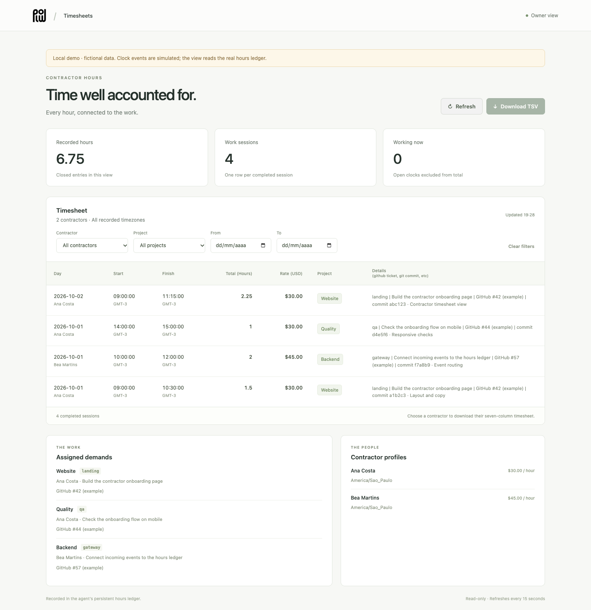
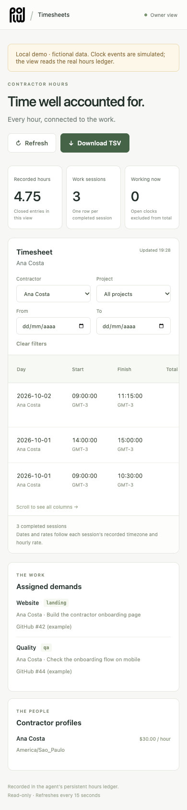

# Plow Hours

Contractor time tracking through iMessage, with a live timesheet linked to assigned work.



[Watch the recorded timesheet demo](https://github.com/EnzoTironi/plow-hours/releases/download/v1/timesheet-demo.webm).

Each contractor has a normal iMessage group with the owner and the agent. They
send `comecei <demand-id>` and `parei <details>`. Plow Hours saves the original
message timestamp before confirming, without waiting for a model or connected
Mac. The owner reviews the same durable record at `/hours` on the agent's web
address. Google Sheets and R2 are optional; the web view needs neither.

## Run locally

You need Docker, Git, Python 3.11+ and the
[plow-agents CLI](https://github.com/plow-pbc/plow-agents).

```sh
git clone https://github.com/EnzoTironi/plow-hours.git
cd plow-hours
plow-agents login
plow-agents lines
plow-agents deploy --local --line ln_xxx
```

Choose a free line from `plow-agents lines`; replace `ln_xxx` with its actual ID.
Text that line to check the agent answers. Open
[the local timesheet](http://localhost:3331/hours). Local access is for development:
anyone who can reach this loopback port has the owner's access. Cloud deployments
use Plow's existing authenticated owner proxy on port 3000.

The image includes `AGENT_ID=plow-hours`, the approved name/blurb, and the base
Agent Index reporter. The boot process registers this install and reports actual
OpenClaw token usage every five minutes. Clock events themselves don't use model
tokens. Registration and usage reporting require real Plow credentials and an
online connection; the offline probe does not register a fake install.

## Onboard a contractor

In the owner's main Plow DM, provide the contractor's name, international phone
number or iMessage email, timezone, hourly USD rate and assigned work. The agent
verifies the actual thread and sender before registering them. Each assigned
demand has an ID, project, summary and references to tickets or commits.

```text
Ana: comecei landing
Agent: Ponto iniciado às 2026-10-02 09:00:00 GMT-3, demanda landing. Envie parei quando terminar.
Ana: parei commit abc123
Agent: Ponto encerrado às 2026-10-02 11:30:00 GMT-3. 2.5 h na demanda landing.
```

`start`, `/in`, `stop` and `/out` are aliases. `ponto` or `/hours` shows that
contractor's current clock in the registered thread. Breaks require stopping and
starting again. A second start or an invalid stop does not change the record.

The owner can correct a session with exact start/finish times and a reason, or
manually record a missed session with its actual historical rate. Previous values
and original message identities remain in the audit history. Registered clock
messages do not grant contractors general tools or access to other contractors.

## Timesheet and state

The web view refreshes every 15 seconds. Filter by contractor, project and
inclusive dates; dates use each session's local start date. Closed sessions count
toward recorded totals. Open clocks are shown separately. Each session preserves
the timezone and hourly rate at its start, including rate changes and daylight
saving transitions. Replays and retries cannot create duplicate sessions.

Select a contractor to download their filtered TSV. It has exactly seven columns:
Day, Start, Finish, Total (Hours), Rate (USD), Project and
Details (github ticket, git commit, etc). Start/finish retain dates, seconds and
offsets. Hour exports use six decimal places; totals sum elapsed time before
rounding. There are no billing increment or overtime rules.



The SQLite database is in `/var/lib/plow/plow-hours/hours.sqlite`, within the
existing persistent volume. Back up using SQLite's backup API or while the agent
is stopped, including its WAL. Redeploy without deleting the volume. R2 can be an
off-host backup destination later. The live record stays on the persistent volume.

The operating [skill](skill/SKILL.md) also generates contractor wiki sources and
optional Sheets projections through Latch. It requires write/readback before
marking a destination current. Native Sheets API creation requires backend OAuth
scopes outside this project. Payments remain a later phase.

## Build, check and publish

The Dockerfile pins the official Plow OpenClaw base by digest. `install.mjs`
adds this repository's modules to that exact base and checks each integration
point before patching it. Keep the base boot, owner proxy and usage reporter.

```sh
docker build -t plow-hours:test .
docker run --rm --network none plow-hours:test /opt/plow/probe
npm ci --ignore-scripts --no-audit --no-fund
docker run --rm --user root --network none \
  -v "$PWD/node_modules:/opt/plow/node_modules:ro" \
  -v "$PWD/tests:/opt/plow/tests:ro" plow-hours:test sh -c \
  '/opt/plow/node_modules/.bin/tsc --noEmit -p /opt/plow/tsconfig.json && mkdir -p /opt/plow/plugin/node_modules && ln -s /app /opt/plow/plugin/node_modules/openclaw && node --test --test-timeout=180000 /opt/plow/tests/*.test.ts'
plow-agents image build ghcr.io/enzotironi/plow-hours:v1
plow-agents image push ghcr.io/enzotironi/plow-hours:v1
plow-agents profile --show
```

Make the GHCR package public. Use the digest printed by push, your Plow account
UID and `plow-hours` for the admin's initial one-click admission. Once admitted,
updates use `plow-agents image push ghcr.io/enzotironi/plow-hours:v2 --promote plow-hours`.
Follow the [Agent Index publishing guide](https://aiworthusing.com/agent-index/publish)
for media registration and WIP review.

The screenshots and demo use fictional contractors and simulated events against
the real ledger/web code. They do not establish live iMessage delivery, actual
Google Sheets/wiki publication or payments. The offline image probe checks the
actual gateway's anonymous rejection, authenticated page/data/assets and rejected
writes. Local clock integration tests use a real SQLite file and transport fixture.

## License

Custom code in this repository is [MIT licensed](LICENSE). The Plow and OpenClaw
base dependencies retain their own licenses. See [NOTICE](NOTICE) for the original
Plow logo and trademark attribution.
