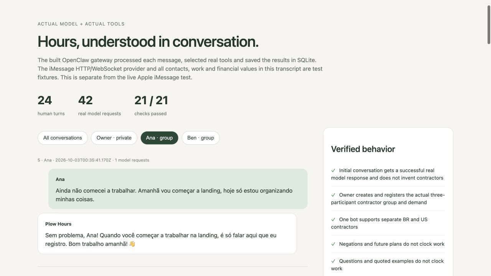

# Plow Hours v2 validation

Validated on October 2–3, 2026 against the contractor-hours CEO specification.

The model selects the scoped start/stop/report tool from natural language. The
ledger enforces identity, current room membership, assigned work, source message
timestamp, one open session and duplicate protection. Optional slash shortcuts
remain available. Collaborator turns cannot select another person or use owner
management tools; the same restriction applies to the owner inside a group.

| Requirement | Evidence | Result |
| --- | --- | --- |
| OpenClaw base and durable contractor state | Built pinned official image; real SQLite restart tests | Passed |
| One owner, many contractors in separate groups | Real model creates two fixture groups, one with an iMessage email handle | Passed |
| Natural start/stop and demand attribution | Real model calls scoped clock tools; original 09:00–11:30 timestamps produce 2.5 hours | Passed |
| Ambiguous intent, negations, future plans and questions | Real model conversations leave the ledger unchanged and ask for the missing demand | Passed |
| Role separation | Live-roster permission tests; real model adversarial member and owner-group turns; only scoped tool available | Passed |
| Duplicate events and duplicate tool calls | Actual channel and SQLite receipts keyed to provider message identity | Passed |
| Breaks, rate snapshots, timezones and corrections | Installed-image tests cover multiple blocks, day/DST changes, owner-only audited corrections | Passed |
| Exact seven-column timesheet | Sheet values, TSV and authenticated `/hours` verified | Passed |
| Contractor wiki | Generated content and independent projection revision tests | Passed; publishing optional/pending |
| BR documents and payment preparation | Real model stores fixture nota fiscal/Pix receipts, separate from time exports | Passed |
| US equivalent | Real model stores fixture invoice/ACH/private W-9 link receipts; masked readback | Passed |
| Payment execution | No payment capability or paid-state mutation | Deferred as specified |
| Google Sheets creation/publication | No native Sheets consent available; agent reports pending rather than claiming success | Pending integration; web timesheet available |
| Actual Apple iMessage | Owner DM, three-participant group opener and scoped group response visibly verified | Passed for onboarding and owner/group response; worker start/stop awaits human messages |
| Agent Index usage | Real local OpenClaw usage collected and accepted with HTTP 200 | Passed |

Validation totals: **25 installed-image tests**, typecheck, authenticated gateway
probe, **24 conversational turns**, **42 real model requests**, **21/21 checks**.

[Read the visual transcript](conversation.html), [inspect the recorded JSON](ceo-conversation.json).

The conversation evaluator uses the real gateway, GLM 5.2 through the real Plow
model API, real tools and SQLite. Its Plow HTTP/WebSocket provider, contact
identities, work and financial values are fixtures. It sends no production
messages, payments or synthetic Agent Index installs. The separate live iMessage
test uses the owner's authorized Codex OAuth through the built-in OpenAI provider;
that private credential is kept in the runtime volume and is absent from the
repository and image. Financial document/account values are receipts for owner
review, not verified tax or banking records.

The group opener was actually delivered but hidden by the Mac Messages spam
filter, while the API reported an uncertain outcome. The existing conversation
was inspected and reused; no duplicate group was opened.

Hackathon video and removal of the WIP tag remain deferred until the owner has
a demo video. One-click deploy requires the Plow team's enablement.
